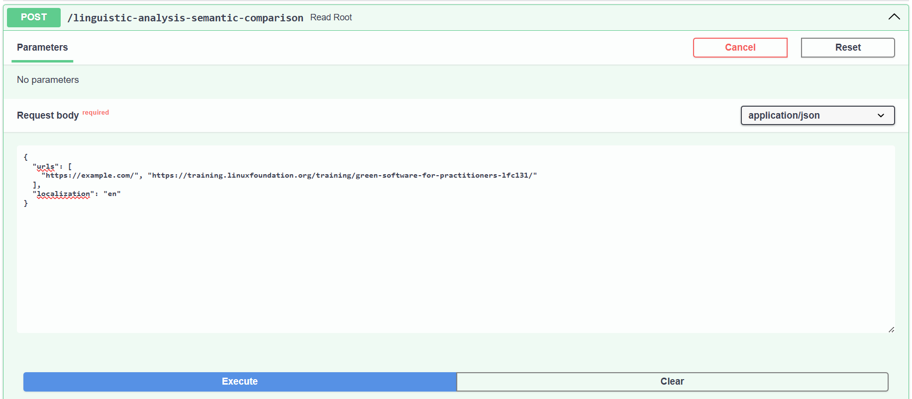

## How to start

### Docker
```bash
docker compose up --build
```

### Local

```bash
cd backend
uv venv
source venv/bin/activate
uv pip install -e .

uv pip install pip
uv run --with spacy spacy download pl_core_news_sm
uv run --with spacy spacy download en_core_web_sm

fastapi dev src/server.py
```

UV provides the PIP interface, but the spacy models are downloaded using native PIP that is why the `uv pip install pip` is needed.

### Tests

```bash
cd backend
uv venv
source venv/bin/activate
uv pip install -e .
python3 -m pytest
```

## API

### POST /linguistic-analysis-semantic-comparison



Example response:
```json
{
  "nouns": [
    {
      "url": "https://example.com/",
      "nouns": {
        "example": 2,
        "domain": 2,
        "use": 1,
        "document": 1,
        "literature": 1,
        "coordination": 1,
        "permission": 1,
        "information": 1
      }
    },
    {
      "url": "https://training.linuxfoundation.org/training/green-software-for-practitioners-lfc131/",
      "nouns": {
        "course": 29,
        "software": 19,
        "development": 7,
        "understanding": 7,
        "practice": 7,
        "content": 6,
        "training": 6,
        "topic": 6,
        "carbon": 6,
        "practitioner": 5,
        "term": 5,
        "sustainability": 5,
        "site": 5,
        "application": 4,
        "principle": 4,
        "chapter": 4,
        "lot": 4,
        "example": 4,
        "news": 4,
        "trademark": 4,
        "promotion": 4,
        "lf": 3,
        "concept": 3,
        "way": 3,
        "material": 3,
        "detail": 3,
        "industry": 3,
        "footprint": 3,
        "energy": 3,
        "world": 3,
        "insight": 3,
        "level": 3,
        "access": 3,
        "certification": 3,
        "source": 2,
        "reward": 2,
        "benefit": 2,
        "sme": 2,
        "profile": 2,
        "design": 2,
        "link": 2,
        "quiz": 2,
        "solution": 2,
        "emission": 2,
        "subject": 2,
        "tech": 2,
        "computing": 2,
        "strategy": 2,
        "information": 2,
        "image": 2
      }
    }
  ],
  "similarities": [
    {
      "url_1": "https://example.com/",
      "url_2": "https://training.linuxfoundation.org/training/green-software-for-practitioners-lfc131/",
      "score": 0.63
    }
  ]
}
```